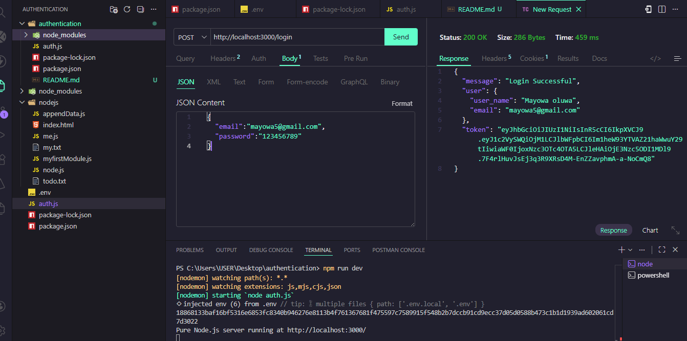
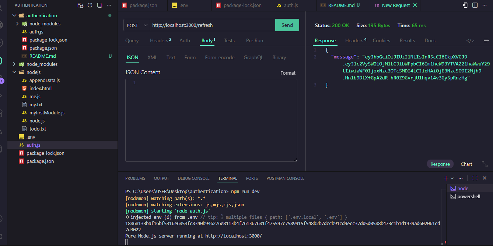

# Backend_project2
It contain all backend task code
# Authentication API

This is a backend authication service built as part of my backend coding task. It handle user registration , login , and secure token generated using cookie with refresh token.

This api supports:
- User registration
- User login
- Password Hashing
- jwt authentication
- welcome email running backround
- Role base athourization

# FEATURES

## Authentication 

- Register Account
- Login accout
- jwt access token generation
- Refresh token generation

## Security

 - password Hashing using bcryt salt 10
 - jwt authenticatoin
 - Refresh token store inside cookies parser
 - sensitive environment variable using `.env`

## Email System
  - gmail as a transporter services
  - welcome email after registration
  - html email format

##  Queue system 

  - BullMq express js queue
  - Redis Worker
  - Background job

## Tech Stack
- **NODEJS $ EXPRESS** (SERVER)
- **Nodemon**(for server auto reload)
- **BCRYPT** (for password hashing)
- **JWT** (for token generation)
- **Cookie Paser** (for token storage)
- **PostgresSQL** (for database)
- **BullMQ** (for queue)
- **Nodemailer** (for sending welcome email to user)
- **Redis** (to store token and add job to queue)

## API EndPoint

| Method | EndPoint | Description |
|:--- | :--- | :--- |
| POST | `/api/auth/register` | Register new user |
| POST | `/api/auth/login` | login and generate a new token |
| POST | `/api/auth/refresh` | refresh and generate new token |
| POST | `/api/auth/logout` | logout and cleared access token |
 

## API TESTING (THURDER CLIENT )

## MiddleWare
express middleware
-- app.use(express.json())
-- app.use(cookieParser())
## Register Endpoint

## Login Endpoint

## Refresh Endpoint
